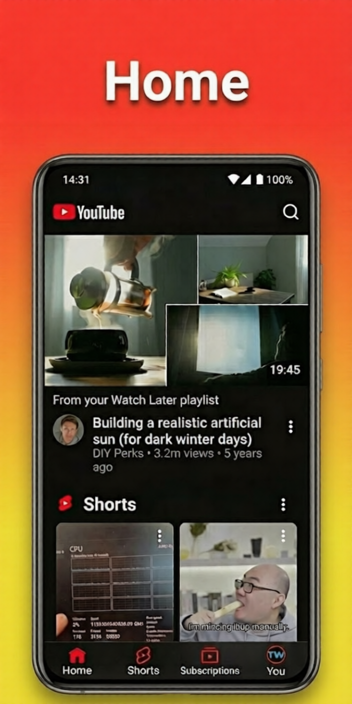
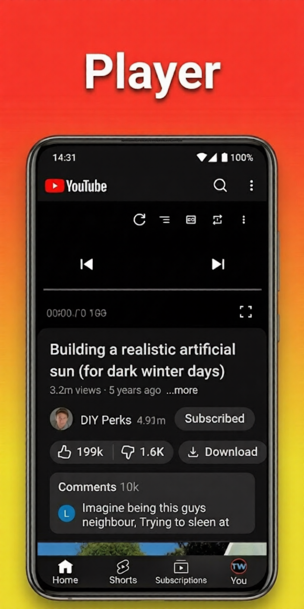
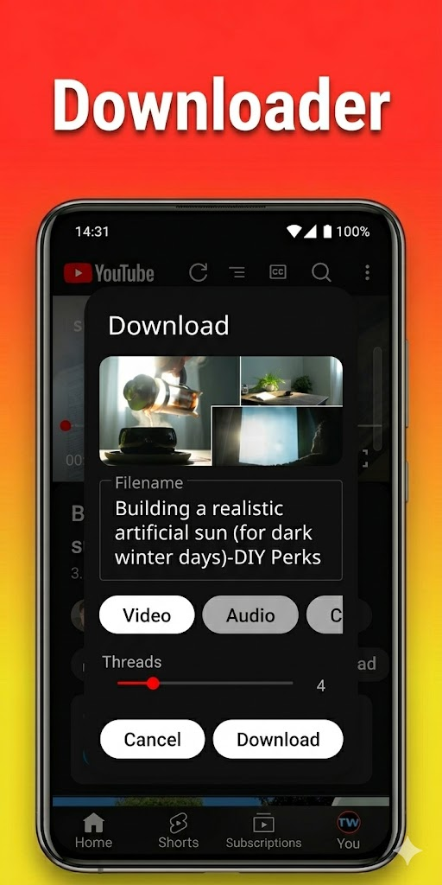
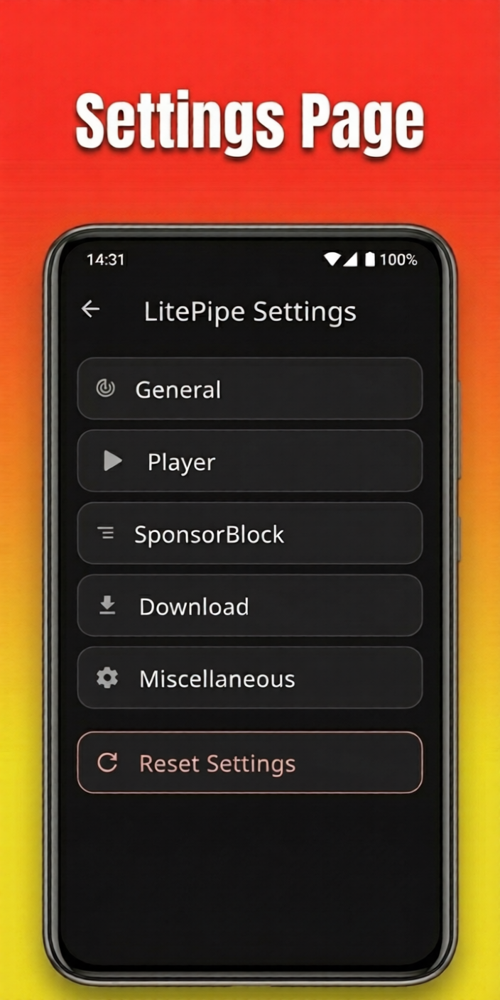
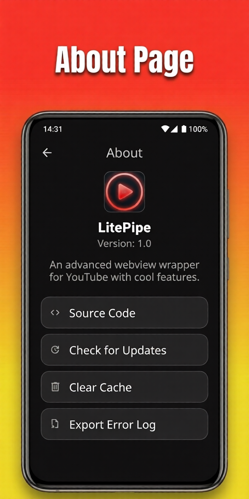

<div align="center">

# LitePipe

**An advanced, performance-focused YouTube client for Android**  
*Ad-free • SponsorBlock • Powerful Downloader • Custom Player • Lightweight WebView Wrapper*


</div>

## ✨ Features

-  **Ad-free:** Completely ad-free YouTube experience.
-  **SponsorBlock:** Automatically skip sponsors, intros, outros, and reminders.
-  **Return YouTube Dislike:** See dislikes again.
-  **Powerful Downloader:** Built-in video, audio, caption, and thumbnail downloader.
-  **Advanced Player:** Custom player supporting subtitles, multiple audio tracks, and gesture controls.
-  **Background Play:** Listen to videos while using other apps or with the screen off.
- ️ **Picture-in-Picture (PiP):** Multitask with a floating video window.
-  **Live Chat:** Full support for live chat during streams.
-  **Modern UI:** Clean Material 3 interface that is fast and responsive.
-  **Playlist Support:** Full support for downloading playlists.

## 📸 Screenshots

<p align="center">
  
  
  
  <br>
  
  
</p>

<details>
  <summary><b>Show More Screenshots</b></summary>
  <p align="center">
    
    
    
    </p>
</details>


## 📥 Installation

### Option 1: Download APK (Recommended)
Download the latest stable APK from the [Releases page](https://github.com/CodeLab-SK/LitePipe/releases).

### Option 2: Build from Source
If you prefer to build it yourself:
```bash
# Clone the repository
git clone https://github.com/CodeLab-SK/LitePipe.git

# Enter the directory
cd LitePipe

# Build the debug APK
./gradlew assembleDebug
```
The APK will be available in `app/build/outputs/apk/debug/`.

## 🚀 How to Use
1. **Install and Open:** Launch the LitePipe app.
2. **Browse:** Search or browse YouTube just like the official app.
3. **Download:** Long-press any video thumbnail to bring up the **Video Options** menu or Press Download button under the Player.
4. **Player Controls:** Use intuitive gestures (swipe for volume/brightness) while watching.

## 🤝 Contributing
Whether you have ideas, bug reports, translations, design improvements, code cleanups, or major feature changes — **all help is welcome**!

### How to Contribute
- **Found a bug?** → Open an [Issue](https://github.com/CodeLab-SK/LitePipe/issues)
- **Have an idea or feature request?** → Open a new issue
- **Want to contribute code?** → Fork the repo and submit a Pull Request

You can open and build the project like any other normal Android project using **Android Studio**.

**Development Guidelines:**
- Follow the [Code of Conduct](Code of Conduct.md).
- Use clear **conventional commit** messages (e.g., `feat: add playlist support`).

## ❓ FAQ
**Q: Is this app safe?**  
**A:** Yes. LitePipe uses the official YouTube mobile site as a base, providing the same level of security while adding powerful enhancements.

**Q: Why use LitePipe instead of the official YouTube app?**  
**A:** LitePipe offers an ad-free experience, skips sponsors, supports background play, and includes a powerful downloader — all while being lighter on battery and storage.

**Q: Does it support playlists?**  
**A:** Yes! Simply long-press any playlist to see the "Download Playlist" option.

**Q: Can I download videos in the background?**  
**A:** Yes. Downloads are managed via a foreground service and will continue even if you switch apps.


## 📜 License

LitePipe is **Free Software** licensed under the [GNU General Public License v3.0](https://www.gnu.org/licenses/gpl.html).

---
<div align="center">
Made with ❤️ by <a href="https://github.com/CodeLab-SK">Sahil Kumar</a> for the Open Source Community
</div>
